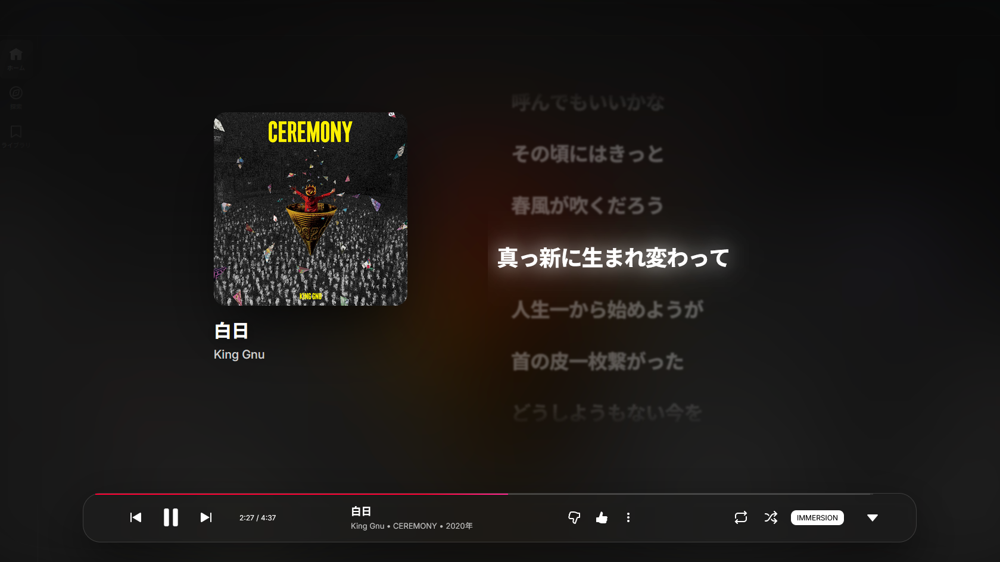

## YouTube Music Modern UI for Firefox
[YouTube Music](https://music.youtube.com) のWeb版再生UIをよりモダンに変更する**Firefox 拡張機能**です。  
[Naikaku](https://github.com/naikaku1) 氏によってChrome向けに開発された [YouTube Music Moden UI](https://github.com/naikaku1/YouTube_Music-Moden-UI) を [cashew](https://github.com/miot26) が独自にFirefox向けに改変しています。

### ✨ Features
- **リアルタイム歌詞同期**: [LRCLIB](https://lrclib.net/) を利用した歌詞同期機能
- **ガラスモーフィズムUI**: 半透明で浮遊感のあるガラスデザインに統一
- **操作性**: ImmersionモードをOFFにすることでキューの確認や検索が可能
- **読みやすいフォント**: "Inter"，"Noto Sans JP" を使用して読みやすい文字に

### 🛠️ Installation Guide
この拡張機能は，Firefox「**デバッグモード**」においてのみ使用できます。  
> [!WARNING]
> ご利用は自己責任となります。
#### 1. ファイルのダウンロード
  1. [Releases](https://github.com/miot26/YTMusic-Modern-Firefox/releases) ページより，最新の `.zip` ファイルをダウンロード
  2. ファイルを任意のフォルダに展開
#### 2. Firefoxで読み込む
  1. `about:debugging#/runtime/this-firefox` に移動
  2. 「一時的な拡張機能」 の `一時的な拡張機能を読み込む` をクリック
  3. 展開したフォルダ内の `src/manifest.json` を選択し，読み込む
#### 3. 使用する
  1. YouTube Musicにアクセスして曲を再生
  2. 画面下部のコントロールバー内 `IMMERSION` をクリックしてUIを起動

### 📱 Supported Browser
> [!IMPORTANT]
> Windows上で開発を行っているため，MacなどではUIに崩れが発生する可能性があります。
- **Firefox**: 145.0.1 (November 18, 2025) on Windows 11
- **Zen Browser**: 1.17.9b (November 24, 2025) on Windows 11

### 🚀 Disclaimer & License
#### セキュリティと利用について
- 本拡張機能に、利用者の個人情報やパスワードを収集する仕組みは一切含まれません。
- 本拡張機能は、YouTube Musicの閲覧体験を向上させることを目的とした非公式の個人制作物です。
- 本拡張機能は **MIT License** のもとで公開されています。

#### 貢献について
- 問題の報告や機能の改善のご提案は，GithubのIssues，Pull Requestより随時お待ちしております。